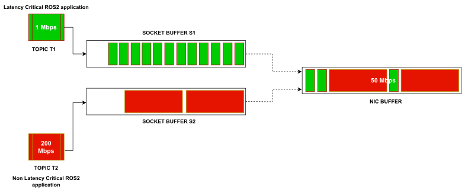

## Overview
The following video presentation gives an overview of the project.

### WHAT IS ROS2?
The Robot Operating System ( ROS ) is a widely used messaging middleware in the robotics industry, but it is not limited to it. It is used for coordinating and communicating between different systems and devices across various industries for multiple use cases. The DDS ( Data Distribution System ) based ROS2 ( Robot Operating System 2 ) uses RTPS ( Real-Time Publish-Subscribe ) protocol as its communication wire. Dynamic discovery of pub-sub ( Publish-Subscribe ) endpoints and an option to set up various application-level QoS ( Quality of Services ) are a few features that the DDS implementation with ROS2 has enabled. The features and QoS offered by ROS2 are briefly discussed in chapter \ref{chap2}. Such features, including rich QoS setup options, have increased their popularity in being used for reliable and low latency, i.e., latency-critical applications over the wireless network. 

### Latency-Critical Application over Wi-Fi and its QoS requirement

Latency-critical applications such as remote driving, remote surgery, or any critical control-based application require high reliability and lower transmission latency of the application data. Such applications usually involve the exchange of sensors' and actuators' messages over the wireless network between the remotely connected ROS2-based endpoints. It is necessary to ensure the QoS requirements of such applications of the ROS2 framework set in a wireless network, e.g., a Wi-Fi network. However, the existing QoS options with ROS2 enable reliability QoS assurance; no QoS options ensure low-latency QoS. Most of the QoS that it assures are application-level QoS.

*Traffic Confluence between two topics' stream at NIC buffer. The larger colored block represents a larger frame size. The green frame is latency critical, and the red frame is non-latency-critical.*

Furthermore, it provides such QoS at the loss of bandwidth. Bandwidth can be a significant bottleneck during remote operations over Wi-Fi or other wireless networks. It is essential to consider the network-level parameters and bottleneck to ensure the end-to-end QoS requirements for such use cases. Hence, assuring the network level QoS in a bandlimited Wi-Fi network is essential for the latency-critical data flow. ROS2 exchange data traffic in the form of topics. Each topic corresponds to a data flow containing sensors' or actuators' messages. 

### NIC buffer: A bottleneck

It has been found that a larger frame-sized packet corresponding to a topic's data flow, enqueued at NIC buffer ahead of a latency-critical topics' packet, can cause significant delay to the latency-critical packets. A similar scenario is demonstrated in fig \ref{fig1.1}. It is realized that the small frame-sized packet of topic T1, requiring less bandwidth, enqueued behind the larger packet of topic T2, requiring more bandwidth at the NIC buffer, suffers in a bandlimited network. We refer to this problem as a ``traffic confluence problem at NIC". 

### Problem Statement

To put it in a statement, ``In a bandlimited network, two or more contending topics' traffic suffer because of each other in terms of latency, throughput, and reliability among other networks and application-level QoS." This statement can be realized based on the results of experiment 1 in chapter \ref{chap5}. 

To get started, see [WiROS Overview][wiros_overview].

