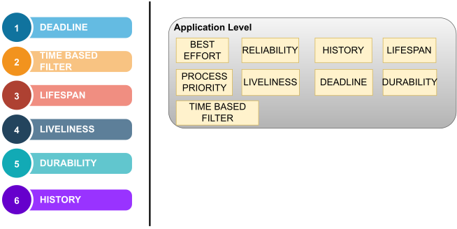

## Introduction

The underlying DDS framework of ROS2 introduces it to set up various QoS ( Quality of Service ) policies. ROS2 defines its offered QoS as several configurable parameters to fine-tune the communication between two nodes. The configurable parameters map to change the properties of various ROS2 entities involving publishers, subscribers, participants, data writers, data readers, and topics. It also facilitates ROS2 communication for adapting to several RTPS protocol modules' operation modes.

Hence, QoS in ROS2 is a suite of policies exposed to the ROS2-based applications to configure parameters for altering the ROS2 communication.

### QoS profiles and Compatibility

A set of ROS2 QoS policies together forms a ROS2 QoS profile. The QoS policies mentioned in the table \ref{table2.1} together form the base ROS2 profile. 

QoS enables the communication between the ROS2 endpoints, i.e., publisher and subscriber, based on the compatibility of the QoS profiles. The QoS compatibility is tested based on the ``Request vs. Offered model." The subscriber requests a ``minimum quality" value of the QoS policies set that it is willing to accept, and the publisher offers the  ``maximum quality"  values of the corresponding QoS policies set that it can provide. The QoS values with higher precedence for the base QoS profile are mentioned in table \ref{table2.1}.

*Basic QoS offered by ROS2*

### QoS Setup: How To

The QoS profile of a ROS2 application can be set at each of the communicating ROS2 nodes. There are following two approaches through which the QoS profiles can be set and implemented: 
\begin{enumerate}[label=( \alph* )]
    * Using ROS2 client libraries: 
    
    The ROS2 client libraries allow the developer to set up various standard QoS profiles and change the value of QoS policies of the QoS profile. The following listing \ref{lst2.1} shows an example of using rclcpp libraries at a ROS2 node's source C$++$ file.
    \label{enum_a}

    \begin{scriptsize}
    \begin{lstlisting}[language=c++,caption={rclcpp based QoS initialization and implementation for a ros2 application}, label=lst2.1]
    size_t depth = rmw_qos_profile_default.depth;   
    // Set the parameters of the quality of service profile. 
    // Initialize as the default profile
    // and set the QoS parameters specified on the command line.
    auto qos =rclcpp::QoS( rclcpp::QoSInitialization( history_policy, depth ) );
    qos.reliability( reliability_policy );
    auto pub = node->create_publisher<sensor_msgs::msg::Image>( topic, qos );
    \end{lstlisting}
    \end{scriptsize}
    
    * Using XML-based configuration: 
    
    The QoS policies and profiles can be configured in an XML file. At the launch environment of the ros2 application, the XML file can be exported as the default QoS profile source. The following listings \ref{lst2.2} and \ref{lst2.3} show an example XML-based QoS configuration and its implementation, respectively.
    \label{enum_b}

    \begin{tiny}
    \lstinputlisting[language=XML, caption={An example XML based QoS configuration}, label=lst2.2]{ros_qos_example.xml}
    \end{tiny}

    \begin{scriptsize}
    \begin{lstlisting}[language=bash,caption={custom XML based QoS implementation for a ros2 application}, label=lst2.3]
    ~/ros2_foxy/install/local_setup.bash 
    export RMW_IMPLEMENTATION=rmw_fastrtps_cpp 
    export FASTRTPS_DEFAULT_PROFILE_FILE=ros_profileCommand.xml
    export RMW_FASTRTPS_USE_QOS_FROM_XML=1
    RMW_IMPLEMENTATION=rmw_fastrtps_cpp ros2 run demo_nodes_cpp talker

    \end{lstlisting}
    \end{scriptsize}

### DDS dependency of QoS policies}

The QoS policies available to ROS2 are abstracted from the underlying DDS framework. There are various open-source, and proprietary implementations of DDS made available by various vendors. eProsima's FastRTPS, Eclipse's Cyclone DDS, GurumNetwork's GurumDDS, and RTI's Connext DDS are a few implementations of DDS available. 
We are working with the foxy version of ROS2 with FastRTPS DDS implementations. However, each DDS distribution offers various QoS capabilities, but not all of them have been exposed to the ros2 framework. For example, eProsima's FastRTPS offers various Standard QoS policies and EProsima's extension QoS policies. Significantly few QoS policies from the standard QoS policies based on time-based filters and EProsima's extension policies have been exposed to the ROS2 framework.

*DDS vendors.*
