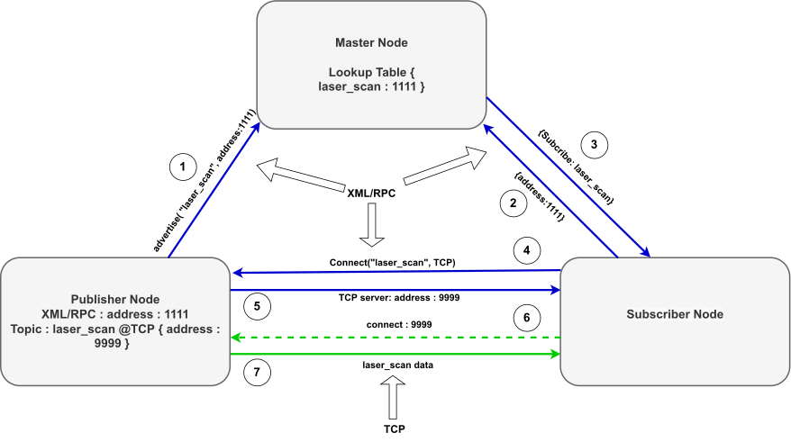
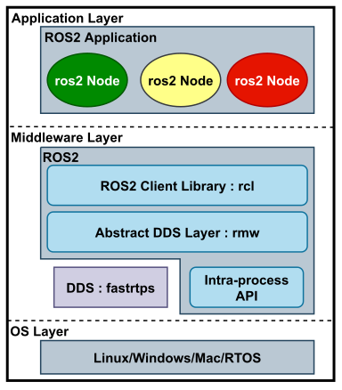
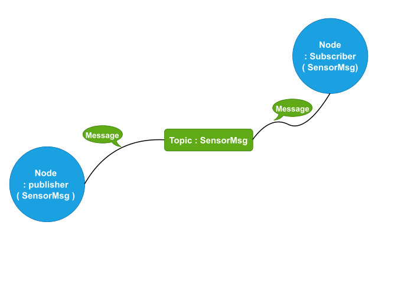
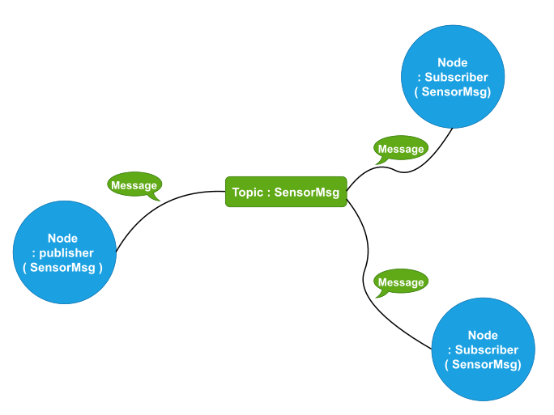

## ROS2: A Communication middleware Suite for Real-Time Application}

### ROS and its shortcomings}

ROS ( Robot Operating System ) is a set of software libraries and tools for building robot applications. It acts as an open-source robotic communication middleware suite. However, ROS was not a framework for real-time use cases. The involvement of the intermediate ROS Master node/system between the communicating ROS server node( s ) and ROS client node( s ), following the process of lookup and registration for discovery, added to the communication latency and caused significant shortcomings for any real-time application. Similarly, the use of communication protocols such as XML-RPC for the discovery of server and client node( s ) or systems( s ) and the use of TCPROS as the default transport protocol for data transfer in the ROS framework has not made it eligible for any real-time use cases. 

*ROS Communication framework: The following ROS communication, also referred to as ROS1 communication, is dependent upon the intermediate master node and communicates over XML/RPC and TCPROS transport protocol.*

### ROS2 development and its popularity}

However, the popularity of the ROS framework due to its modular and richer libraries for robotics applications development and the requirement of its use for real-time applications led to the development of DDS ( Data Distribution System ) based ROS2. 

*ROS2 real-time use cases and its popularity.*

Following are the features of ROS2 that have made it omnipresent for real-time robotic applications and is considered to be a great enhancement to the previous ROS framework: 
* Masters node Independency: Unlike ROS, ROS2 bypass the requirement of any Master node and hence significantly reduces the communication latency and increases the reliability of data exchange between the client and the server system. 
* RTPS transport protocol: ROS2 uses RTPS ( Real Time Publish Subscribe ) protocol as its communication protocol. This protocol uses UDP as its underlying by default, unlike TCP as the underlying protocol by ROS. Hence, lower latency is experienced.  
* Dynamic Discovery: Unlike ROS, which uses an IP address lookup table to establish a connection based on the communicating system, the RTPS protocol of ROS2 enables dynamic discovery of both the communicating parties. 
* Rich QoS: The underlying DDS framework of ROS2 avails multiple QoS controls. ROS2 provides flexibility to set various application-level QoS parameters. It has popularized ROS2 as a QoS-rich middleware suite. 

## ROS2 Framework

### Architecture of ROS2

ROS2 is developed on top of the DDS ( Data Distribution System ). The architecture of ROS2 is shown in figure \ref{fig2.3.a}. The ROS2 middleware sits between the application layer and the operating system. The middleware comprises rmw, i.e., ROS2 middleware that abstracts away the DDS layer, rcl, i.e., ROS2 client libraries that provide ROS2 applications the libraries for development and interfacing with rmw. The DDS acts as the heart of rmw, which avail the transport mechanism, serialization \& deserialization of ROS2 traffic and the QoS setups for the ROS2 applications. 

*ROS2 architecture. *

*DDS-based ROS2 communication.*

The ROS2 applications sit at the system's application layer comprised of ROS2 nodes. The nodes exchange data via topics, services, actions, or parameters. A node can be publisher( s ) of data flow( s ), subscriber( s ), or both. Each node corresponds to single or multiple operations in a robotic application.

Publish-Subscribe model, Topics and Dynamic Discovery}

The DDS-based architecture of ROS2 uses RTPS ( Real Time Publish Subscribe )  protocol as the communication protocol. The RTPS protocol involves communication between publisher( s ) and subscriber( s ) endpoints. The publisher publishes the data, and the subscriber subscribes to it. Each participant ROS2 node can have multiple publishers and subscribers. 

However, there are methods of communication between the ROS2 nodes based on request-response, namely service, parameters, and actions. The publish-subscribe-based method involving the topic concept is the most commonly used method for ROS2 node communication. This has been shown in figure \ref{fig2.3.b}. A topic acts as a bus for publishing and subscribing a data of a particular type. Each node publishes messages of a particular data type over a particular topic. Each topic has a name associated with it to which any number of publishers can publish, and subscribers can subscribe. 

*Topics in ROS2.*

*Dynamic Discovery in ROS2 with one new subscriber.*

The publisher and subscribers start communicating based on the dynamic discovery mechanism enabled by DDS-RTPS. For other generic client-server pairs, endpoints must know each other's socket address, i.e., port number and IP address, to establish communication between them. However, at ROS2, with the help of dynamic discovery, two nodes publishing or subscribing to the same topic can start exchanging data streams without specific knowledge of the application stream's port number or the host system's IP address. The underlying knowledge of the socket address is defined and communicated via RTPS protocol between all the communication endpoints. 

### ROS\_DOMAIN

However, the communicating endpoints must be in the same ROS2 network domain sharing a common ID called ROS\_DOMAIN\_ID. A ROS\_DOMAIN\_ID is a representation of a logical network over a physical network. A physical network can have multiple logical networks. ROS2 prohibits two logical networks with different ROS\_DOMAIN\_IDs from communicating with each other. Each participant in a ROS2 communication is represented by an ID called PARTICIPANT\_ID. The participant id increases by one with each new node at an end-system. The ROS\_DOMAIN\_ID and the PARTICIPANT\_ID help compute the port number involved in the dynamic discovery and exchange of data traffic between all the ROS2 nodes in a particular ROS2 domain. 

The ROS\_DOMAIN\_ID should be configured, considering that the computed port numbers do not collide with the Linux system's ephemeral port numbers. The ephemeral port numbers are the predefined range of port numbers defined for IP communication at the transport layer. Hence, these need to be different from the ones used by ROS2 discovery and other RTPS protocol-level communication. It thus limits the maximum number of ROS2 nodes active at an end-system communicating in a ROS2 domain. 

